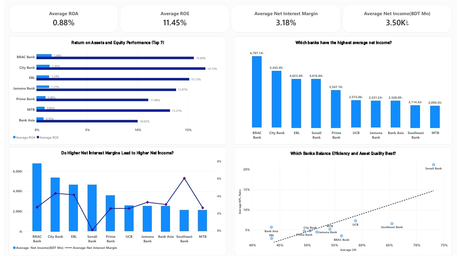

# Bangladesh Banking Sector Financial Performance Dashboard

## 📊 Project Overview

The **Bangladesh Banking Sector Financial Performance Dashboard** is an interactive **Power BI financial analytics project** designed to evaluate and compare the financial performance of selected leading commercial banks in Bangladesh.
![Bangladesh Banking Sector Dashboard - Executive Overview]

The dashboard brings together key indicators covering **profitability, asset quality, capital adequacy, liquidity, operational efficiency, earnings, and market performance**. It enables users to compare banks, identify sector-level trends, evaluate relative strengths and weaknesses, and explore individual bank performance.

The analysis primarily focuses on **average annual reported performance over the examined period**, allowing a consistent comparison of banks across multiple financial dimensions.

The project is designed as a data-driven decision-support tool for analysts, researchers, investors, students, and anyone interested in understanding the financial performance of the Bangladesh banking sector.

---

## 🎯 Project Objectives

The main objectives of this project are to:

* Compare the financial performance of leading Bangladeshi commercial banks.
* Evaluate average profitability across the examined period.
* Assess asset quality and credit-risk exposure.
* Examine capital adequacy and financial resilience.
* Analyze liquidity and operational efficiency.
* Compare market valuation and earnings performance.
* Identify the strongest and weakest performers across major financial indicators.
* Develop an overall comparative ranking of banks.
* Present complex banking-sector information through an interactive Power BI dashboard.

---

## 🏦 Banks Covered

The dashboard analyzes the financial performance of **11 selected commercial banks in Bangladesh**, covering both private-sector and government-owned banking institutions.

| Bank ID | Bank Name                  | Short Name     | Ownership  |
| ------- | -------------------------- | -------------- | ---------- |
| B001    | Bank Asia PLC              | Bank Asia      | Private    |
| B002    | BRAC Bank PLC              | BRAC Bank      | Private    |
| B003    | City Bank PLC              | City Bank      | Private    |
| B004    | Dhaka Bank PLC             | Dhaka Bank     | Private    |
| B005    | Eastern Bank PLC           | EBL            | Private    |
| B006    | Jamuna Bank PLC            | Jamuna Bank    | Private    |
| B007    | Mutual Trust Bank PLC      | MTB            | Private    |
| B008    | Prime Bank PLC             | Prime Bank     | Private    |
| B009    | Sonali Bank PLC            | Sonali Bank    | Government |
| B010    | Southeast Bank PLC         | Southeast Bank | Private    |
| B011    | United Commercial Bank PLC | UCB            | Private    |

### Ownership Composition

The selected sample consists of:

* **10 private commercial banks**
* **1 government-owned commercial bank**
* **11 banks in total**

This sample provides a comparative view of financial performance across major private-sector institutions while also including **Sonali Bank** as the government-owned institution in the analysis.

> **Note:** The analysis is based on the selected 11-bank sample and should therefore be interpreted as a comparative assessment of these institutions rather than a comprehensive assessment of the entire Bangladesh banking sector.
---

# 📌 Key Financial Indicators

The dashboard evaluates banks using a broad set of financial indicators.

### Profitability

| Indicator  | Description                  |
| ---------- | ---------------------------- |
| ROA        | Return on Assets             |
| ROE        | Return on Equity             |
| NIM        | Net Interest Margin          |
| Net Income | Profit generated by the bank |
| EPS        | Earnings Per Share           |

### Asset Quality & Credit Risk

| Indicator           | Description                                          |
| ------------------- | ---------------------------------------------------- |
| NPL Ratio           | Non-Performing Loan ratio                            |
| Total NPL           | Total value of non-performing loans                  |
| Loan-Loss Provision | Provision maintained against potential credit losses |

### Capital Strength

| Indicator            | Description            |
| -------------------- | ---------------------- |
| CAR                  | Capital Adequacy Ratio |
| Tier-1 Capital Ratio | Core capital strength  |

### Liquidity & Efficiency

| Indicator | Description           |
| --------- | --------------------- |
| LDR       | Loan-to-Deposit Ratio |
| CIR       | Cost-to-Income Ratio  |

### Market Performance

| Indicator    | Description                      |
| ------------ | -------------------------------- |
| P/B Ratio    | Price-to-Book Ratio              |
| EPS          | Earnings Per Share               |
| Market Value | Market-based valuation indicator |

---

# 🔎 Combined Key Findings

## 1. Overall Sector Performance

The analysis indicates that the Bangladesh banking sector has experienced **overall growth in assets, deposits, and earnings**, although performance remains uneven across individual institutions.

Key sector-level observations include:

* Average total assets reached approximately **BDT 509.07 billion**.
* Average net income was approximately **BDT 3.50 billion**.
* Average **ROA was 0.88%**.
* Average **ROE was 11.45%**.
* Average **NIM was approximately 3.18%**.
* Average **LDR was 72.68%**, indicating generally comfortable liquidity conditions.

Overall, the sector demonstrates a combination of **moderate profitability, adequate liquidity, and relatively strong capital positions**, but significant differences exist between individual banks.

---

# 🏆 2. Overall Bank Performance

Based on the project's composite performance assessment, the leading banks are:

| Rank | Bank                  |
| ---: | --------------------- |
| 🥇 1 | **BRAC Bank**         |
| 🥈 2 | **City Bank**         |
| 🥉 3 | **Prime Bank**        |
|    4 | **Jamuna Bank**       |
|    5 | **Mutual Trust Bank** |
![Overall Bank Performance Scorecard]

### Leading Performers

**BRAC Bank** emerges as the strongest overall performer, supported by strong profitability, capital strength, market valuation, and high net income.

**City Bank** demonstrates particularly strong shareholder profitability and records the **highest ROE** among the analyzed banks.

**Prime Bank** maintains balanced performance across profitability, capital adequacy, and other financial indicators.

**EBL** also demonstrates strong and balanced performance, particularly in profitability, capital adequacy, and market-related indicators.

### Important Interpretation

The overall ranking is intended to provide a **relative comparison across multiple financial dimensions**. It should not be interpreted as a definitive measure of the intrinsic quality or future performance of a bank.

The ranking methodology should be considered together with the individual indicator results and the period covered by the analysis.

---

# 💰 3. Profitability Analysis

Profitability is one of the strongest differentiating factors among the banks analyzed.
![Profitability Analysis]

### Key Findings

* **BRAC Bank records the highest average net income** among the analyzed banks.
* **City Bank records the highest ROE**, indicating strong returns generated for shareholders.
* **BRAC Bank leads in ROA**, suggesting stronger asset utilization and profitability relative to its asset base.
* Average sector **ROA stands at approximately 0.88%**.
* Average sector **ROE stands at approximately 11.45%**.
* Average **NIM is approximately 3.18%**.

### Earnings Trend

EPS increased substantially over the examined period, rising from approximately **2.77 to 6.77**.

This suggests an overall improvement in earnings generation, although the improvement is not uniform across all institutions.

### Key Insight

The analysis suggests that stronger NIM can support profitability, but **profitability depends on multiple factors**, including operating efficiency, credit quality, capital structure, and the bank's ability to control costs and losses.

---

# ⚠️ 4. Asset Quality & Credit Risk


Asset quality represents one of the most important challenges identified by the analysis.
![Asset Quality and Capital]

### Rising NPLs

* Average NPL ratio is approximately **6.45%**.
* Total NPL volume increased substantially between **2021 and 2024**.
* NPLs reached approximately **BDT 42.18 billion in 2024** before showing a moderate decline in 2025.

The increase in non-performing loans indicates growing pressure on credit quality despite improvements in several profitability indicators.

### Bank-Level Risk

**Sonali Bank** consistently records the highest NPL exposure among the analyzed institutions.

This highlights an important distinction in the analysis: a bank may demonstrate strong earnings or EPS while simultaneously facing significant asset-quality challenges.

### Provisioning Concern

The analysis indicates that growth in loan-loss provisions has not fully matched NPL growth for some institutions.

If credit quality continues to deteriorate, insufficient provisioning could place additional pressure on:

* Future profitability
* Capital adequacy
* Loan-loss absorption capacity
* Financial stability

### Key Insight

> **Asset quality remains the most significant risk area identified by the dashboard.**

---

# 🛡️ 5. Capital Strength

The banking sector demonstrates generally strong capital adequacy.


### Key Findings

* Average **CAR is approximately 13.79%**.
* Most banks maintain Tier-1 capital ratios above applicable regulatory benchmarks.
* **BRAC Bank** demonstrates one of the strongest capital positions.
* **Prime Bank** and **EBL** also maintain strong capital adequacy.

Strong capital buffers provide banks with greater capacity to absorb unexpected losses.

However, sustained deterioration in asset quality could eventually place pressure on capital ratios, particularly for banks experiencing significant NPL growth.

### Key Insight

> Strong capital adequacy is one of the major strengths of the banking sector, but maintaining these buffers will depend partly on successful credit-risk management.

---

# 💧 6. Liquidity & Operational Efficiency

## Liquidity

The average **LDR of 72.68%** indicates generally comfortable liquidity conditions across the analyzed banks.

![Liquidity and Efficiency]
Most institutions appear to maintain sufficient funding capacity without excessive lending pressure.

However, LDR should not be interpreted in isolation because an extremely high or extremely low ratio is not automatically better. Liquidity should be assessed together with deposit stability, asset quality, funding structure, and regulatory requirements.

---

## Operational Efficiency

The **Cost-to-Income Ratio (CIR)** reveals substantial differences in operational efficiency.

### Efficiency Leaders

* **Bank Asia** records the lowest CIR and therefore demonstrates the strongest cost efficiency among the analyzed banks.
* **EBL** and **Dhaka Bank** also demonstrate relatively strong cost management.

### Efficiency Challenge

**Sonali Bank** records the highest CIR, indicating comparatively weaker operational efficiency.

Higher operating costs can reduce the amount of revenue that ultimately translates into profitability.

### Profitability-Efficiency Relationship

The analysis indicates that banks with lower CIR generally tend to demonstrate stronger ROA and profitability.

This suggests that **cost control is an important contributor to sustainable bank profitability**.

---

# 📈 7. Market Performance

Market indicators provide another perspective on bank performance beyond traditional accounting ratios.
![Market Performance]
### Market Valuation Leaders

**BRAC Bank** records the highest **Price-to-Book (P/B) ratio**, indicating strong market valuation relative to its book value.

**EBL** and **City Bank** also demonstrate favorable market valuations.

### Market Value & Book Value

The analysis indicates a positive relationship between market value and book value across the analyzed banks.

BRAC Bank stands out as the strongest market performer among the peer group.

### EPS Performance

**Sonali Bank records the highest EPS** among the analyzed banks.

However, this result also demonstrates why individual indicators should not be interpreted in isolation: strong EPS does not necessarily imply strong overall financial health when asset quality and operational efficiency are considered.

---

# 📊 8. Overall Strategic Insights


## Strengths of the Banking Sector

The analysis identifies several positive characteristics:

* ✅ Strong overall capital adequacy
* ✅ Average CAR of approximately **13.79%**
* ✅ Steady growth in assets and deposits
* ✅ Improving earnings performance
* ✅ Average LDR of approximately **72.68%**
* ✅ Improving profitability indicators
* ✅ Strong market valuation among leading banks
* ✅ Strong performance from several major private commercial banks

---

## Key Challenges

At the same time, several risks require continued attention:

* ⚠️ Rising non-performing loans
* ⚠️ Increasing credit-risk concentration in some institutions
* ⚠️ Significant variation in operational efficiency
* ⚠️ Provision growth not fully matching NPL growth in some cases
* ⚠️ Large performance differences between leading and weaker banks
* ⚠️ Potential future pressure on profitability and capital if asset quality deteriorates

---

# 🏅 Overall Performance Perspective

One of the major conclusions from the dashboard is that **no single financial indicator provides a complete picture of bank performance**.

For example:

* A bank may have high EPS but also high NPL exposure.
* A bank may have strong profitability but weaker cost efficiency.
* A bank may have strong capital adequacy but lower market valuation.
* A bank may have strong market valuation because of investor confidence while still facing asset-quality challenges.

Therefore, the dashboard evaluates banks across multiple dimensions rather than relying on a single metric.

The overall performance assessment places particular emphasis on:

1. Profitability
2. Asset quality
3. Capital strength
4. Operational efficiency
5. Liquidity
6. Market performance

This multidimensional approach provides a more balanced comparison of the selected banks.

---

# 🧮 Overall Ranking Methodology

The dashboard's overall ranking is designed to compare banks across multiple financial indicators.

For indicators where **higher values represent stronger performance**, such as:

* ROA
* ROE
* NIM
* CAR

higher performance receives a stronger ranking.

For indicators where **lower values represent stronger performance**, such as:

* NPL Ratio
* CIR

lower values receive a stronger ranking.

The resulting indicator-level rankings can then be combined to produce an overall comparative ranking.

### Important Note on LDR

LDR is treated primarily as a **liquidity indicator** rather than automatically assuming that a higher or lower value is better. An optimal LDR depends on the bank's funding structure, lending strategy, liquidity position, and regulatory environment.

Therefore, LDR should be interpreted separately unless a clearly justified benchmark or target range is introduced.

---

# 📅 Interpretation of Average Performance

A central feature of this project is the use of **average annual bank-level performance over the examined period**.

For example, the reported average ROA represents the average of the bank's annual ROA observations across the period covered by the dataset.

Therefore:

> **The dashboard compares typical performance over the examined period rather than ranking banks solely according to their latest-year results.**

This distinction is important when interpreting the findings.

The averages are useful for identifying relatively consistent performers, but they may hide individual-year shocks or periods of rapid deterioration/improvement.

---

# 📑 Dashboard Structure

The Power BI report is organized into several analytical sections.

### 1. Executive Overview

Provides a high-level view of:

* Sector assets
* Net income
* Profitability
* Liquidity
* Major performance indicators
* Overall sector trends

### 2. Profitability Analysis

Focuses on:

* ROA
* ROE
* NIM
* Net income
* EPS
* Profitability comparisons

### 3. Asset Quality & Capital

Examines:

* NPL ratio
* Total NPL
* CAR
* Tier-1 capital
* Credit-risk trends

### 4. Liquidity & Efficiency

Analyzes:

* LDR
* CIR
* Cost efficiency
* Liquidity conditions
* Profitability-efficiency relationships

### 5. Market Performance

Evaluates:

* P/B ratio
* EPS
* Market value
* Book value
* Market-performance relationships

### 6. Bank Performance Scorecard

Provides:

* Overall bank ranking
* Cross-bank comparison
* Major financial indicators
* Relative performance assessment

### 7. Bank Profile & Financial Deep Dive

Allows users to investigate the financial characteristics and performance of an individual bank in greater detail.
![Bank Profile and Financial Deep Dive]
---

# 📊 Visualization Approach

The dashboard uses different visual types according to the analytical purpose.

| Analytical Purpose              | Recommended Visual       |
| ------------------------------- | ------------------------ |
| KPI / headline metric           | Card                     |
| Bank comparison                 | Bar / Column Chart       |
| Annual trend                    | Line Chart               |
| Relationship between indicators | Scatter Plot             |
| Overall ranking                 | Ranked Bar Chart / Table |
| Detailed bank comparison        | Matrix / Table           |
| Target or benchmark comparison  | Bullet / Gauge           |

The design follows the principle of selecting visuals according to the analytical question rather than using different chart types merely for visual variety. Microsoft similarly recommends choosing visuals that make comparisons easy to interpret and avoiding unnecessary complexity.

---

# 🛠️ Tools & Technologies

### Microsoft Power BI

Used for:

* Data modeling
* Data transformation
* DAX calculations
* Interactive visualizations
* Financial analysis
* Cross-filtering
* Drill-through analysis
* Dashboard development

### Data Analysis

The project uses financial indicators and annual observations to compare the performance of selected Bangladeshi commercial banks.

### DAX

DAX is used where required for:

* Performance calculations
* Ranking
* Dynamic bank selection
* Comparative analysis
* Aggregation
* Interactive dashboard logic

---

# 🧠 Key Takeaways

### 🥇 Strongest Overall Performer

**BRAC Bank** emerges as the leading overall performer, supported by strong profitability, capital strength, net income, and market valuation.

### 💰 Strongest Shareholder Profitability

**City Bank** records the highest ROE, highlighting strong shareholder return generation.

### 📈 Strongest Asset Utilization

**BRAC Bank** leads ROA, indicating strong profitability relative to its asset base.

### 🏦 Strong Capital Position

**BRAC Bank, Prime Bank, and EBL** demonstrate particularly strong capital positions.

### ⚙️ Strongest Operational Efficiency

**Bank Asia** records the lowest CIR, indicating strong cost efficiency.

### ⚠️ Largest Credit-Risk Concern

**Sonali Bank** records the highest NPL exposure among the analyzed banks.

### 📊 Strongest Market Valuation

**BRAC Bank** records the highest P/B ratio, reflecting strong market valuation relative to book value.

### 🚨 Main Sector Risk

The most important concern identified by the analysis is the **growth in non-performing loans** and the potential consequences for profitability, provisioning, and capital strength.

---

# 📝 Executive Conclusion

The Bangladesh Banking Sector Financial Performance Dashboard provides a multidimensional assessment of selected commercial banks by combining profitability, asset quality, capital adequacy, liquidity, operational efficiency, earnings, and market-performance indicators.

The analysis indicates that **BRAC Bank, City Bank, and Prime Bank are among the strongest overall performers**, with BRAC Bank particularly distinguished by its profitability, capital strength, net income, and market valuation.

At the sector level, the banking industry demonstrates several positive characteristics, including **strong capital adequacy, steady asset growth, improving earnings, and generally comfortable liquidity conditions**.

However, **rising non-performing loans remain the most significant concern**. The increase in NPLs, together with uneven provisioning and operational efficiency across institutions, could create pressure on future profitability and capital if credit quality continues to weaken.

The findings therefore suggest that the long-term sustainability of Bangladesh's banking sector will depend not only on maintaining profitability and capital buffers, but also on:

* Strengthening credit-risk management
* Reducing non-performing loans
* Improving loan recovery
* Maintaining adequate provisioning
* Controlling operating costs
* Preserving strong capital buffers
* Maintaining prudent liquidity management

Ultimately, the dashboard demonstrates that **bank performance should be evaluated across multiple dimensions rather than through a single financial ratio**.

---

# 🚀 Future Improvements

Potential future enhancements include:

* Adding additional years as data becomes available.
* Introducing peer-group benchmarking.
* Adding regulatory benchmark indicators.
* Developing a weighted composite performance score.
* Adding year-over-year performance analysis.
* Incorporating macroeconomic indicators such as GDP growth and inflation.
* Adding dividend and shareholder-return analysis.
* Developing automated data-refresh functionality.
* Adding more detailed bank-level drill-through analysis.
* Incorporating statistical analysis of relationships between financial indicators.

---

# 📂 Suggested Project Structure

```text
Bangladesh-Banking-Financial-Performance/
│
├── README.md
│
├── data/
│   └── cleaned_banking_data.csv
│
├── powerbi/
│   └── Bangladesh_Banking_Performance.pbix
│
├── screenshots/
│   ├── executive_overview.png
│   ├── profitability.png
│   ├── asset_quality.png
│   ├── liquidity_efficiency.png
│   ├── market_performance.png
│   ├── scorecard.png
│   └── bank_deep_dive.png
│

```

# ⚠️ Methodological Disclaimer

This dashboard is intended for **analytical and educational purposes**.

The results are based on the financial data and reporting period included in the underlying dataset. Differences in accounting practices, reporting periods, data availability, and bank-specific characteristics may affect comparisons.

The overall ranking is a **comparative analytical measure**, not an investment recommendation or an official assessment of bank soundness.

Average values should also not be interpreted as representing the latest financial year or as a weighted sector-wide ratio unless explicitly stated.

# 👤 Author

** Nafizur Rahaman**

**Project:** Bangladesh Banking Sector Financial Performance Dashboard
**Platform:** Microsoft Power BI
**Focus:** Banking Sector Financial Performance Analysis


## ⭐ Project Summary

> **The Bangladesh Banking Sector Financial Performance Dashboard transforms multi-year banking data into an interactive analytical framework for comparing profitability, credit quality, capital strength, liquidity, efficiency, earnings, and market performance across leading Bangladeshi commercial banks.**

The central finding is clear:

**Bangladesh's banking sector demonstrates strong capital and liquidity foundations and improving profitability, but rising non-performing loans remain the critical challenge to long-term financial stability.**
